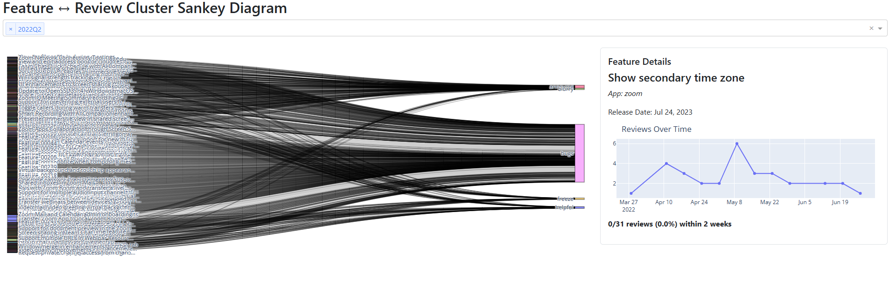

# sankey-viz
An interactive visualization that links the traceability between released software features for different apps and their reviews.

Interactive Visualization Link - [Interactive Sankey Diagram](https://sankey-viz.onrender.com)

Directions to Interact with the Visualization:

***Disclaimer: If the link has been inactive for some time, the visualization may take a couple of minutes to load. Please allow 1-2 minutes for the site to load.***

**Step 1** - Choose a time period to view the Sankey Diagram for. Eg., if you choose 2022Q1, the diagram will show feature-review links for reviews posted in Q1 (first 3 months) of 2022.  

**Step 2** - The diagram will now be visible for the specified Quarter.
  - The feature nodes (with Feature Titles if available) will be on the far left of the diagram.
  - The review clusters will be on the far right of the diagram.
  - The 'links' (black lines) represent the number of reviews that mention a specific feature and match a review cluster.
      - For example, there are 50 reviews total mentioning "Video Background", out of those there are 10 reviews that match to the cluster "blurry". Then the black line from feature "Video Background" to cluster "blurry" represents those 10 reviews.

**Step 3** - Click on any black line to view the Feature Details Panel.
  - This panel will be a details page for the clicked link
  - It will mention the feature name and feature release date (1st temporal dimension)
  - It will also show a graph for how many reviews the feature has over time, along with an approximate date of the reviews posted (2nd temporal dimension)
  - Lastly, it will also show a % of reviews that were posted within 2 weeks of the feature being released (potential 3rd temporal dimension)

And that's it! You can repeat any of the above steps to test the visualization. Please keep in mind that the rendering may slow down after some time due to the very large datasets the visualization is dealing with.
